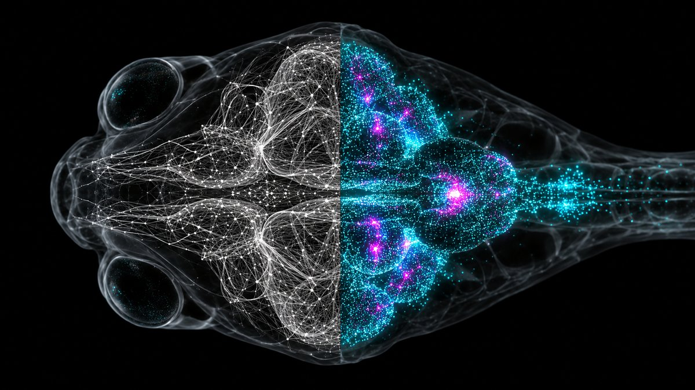

# ZAPFISH

A zebrafish whole-brain activity model that can operate a crypto trading account, play table tennis, ride a bike and walk a dog. Real recorded neurons, actual Coinbase integration, honest scoreboards. **Profitable learning has not been demonstrated. The fish returns about one ball in three.**

**How it works:** the model is fitted to [ZAPBench](https://google-research.github.io/zapbench/), Google Research and Janelia's whole-brain light-sheet recording of one larval zebrafish: **71,721 neurons, 7,879 frames, nine stimulus conditions**. We download a checksum-locked subset of the public traces, select 2,048 cells spread across the brain, and fit a linear activity model (three frames of history, ridge regression, one-step R² 0.92). Public Coinbase prices become an RGB chart. Its brightness drives 256 **light-responsive** cells (chosen by their response to full-field flashes in the recording). A fixed readout compares 128 right versus 128 left **turning-responsive** hindbrain cells and proposes buy, sell or hold when 16 **gate** cells are active. A custom Coinbase Advanced ActionProvider checks limits and places spot orders.

Positive portfolio P&L pulses 15 designated reward cells; negative P&L pulses 2 aversive cells. The candidate memory rule from [STONKFLY](https://github.com/nftechie/stonkfly) (an adaptation of Huang, Luo et al. 2024) changes 64,748 fitted light→readout edges. These are engineered reinforcement signals, **not modeled pain or pleasure**. Nothing in this repository uses the Fish Fire&Wire connectome; it is still being proofread and is released by application. [Model and evidence](docs/model.md).

The same brain, refitted on its 545 population cells so it runs in a browser at 16 Hz, holds a paddle, handlebars and a leash in [`site/`](site/). [What we saw](docs/validation.md).

## Run it

Python 3.11+, any OS. The public data subset is 257 files, about 260 MB.

```sh
python -m pip install -e '.[test]'
python -m zapfish prepare          # download + verify against sources.lock.json
python -m zapfish train            # fit data/zapbench/model.npz (~1 min)
python -m zapfish run --fixture --fast --steps 6 --out runs/fixture
python -m zapfish run --steps 10   # real public prices, paper fills, $100 simulated
python -m pytest -q
```

For real orders, first create a dedicated Coinbase Advanced portfolio with **at most 100 USDC** and a portfolio-scoped **ECDSA API key with View + Trade, no Transfer**. `pip install -e '.[live]'`, copy `.env.example` to `.env`, fill it in locally, then run these commands yourself:

```sh
python -m zapfish run --live --preflight-only
python -m zapfish run --live
```

Defaults: $10 maximum order including reserved fees, 24 attempts/day, no shorts or leverage. A $20 drawdown stops new orders; **it does not liquidate holdings or cap further losses**. [Operation and recovery](docs/operations.md).

## The site

`site/` is the static site: the Observatory (all 71,721 recorded neuron positions lit by real activity, a condition scrubber, our model's held-out prediction), the three everyday tasks with the brain running live, and the trading desk. Serve it with any static server:

```sh
cd site && python -m http.server 8140
```

## Attribution

Execution layer, plasticity rule and honesty rules are from STONKFLY (MIT, nftechie). Data: ZAPBench 20240930 (Google Research and Janelia), used under its open release terms. This project is not affiliated with Google, Janelia, Coinbase or STONKFLY. See [THIRD_PARTY.md](THIRD_PARTY.md).
